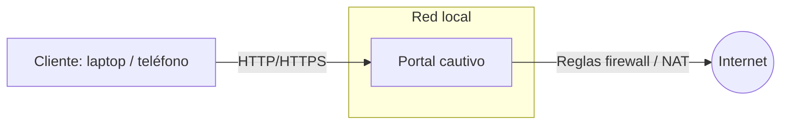

# Arquitectura lógica — Portal cautivo (Proyecto Redes 2025)

**Propósito:** describir los módulos principales del sistema, sus responsabilidades, cómo interactúan entre sí y dónde encajan las mejoras/funcionalidades extras (HTTPS, NAT, detección de portal, anti‑suplantación). Este documento guía el desarrollo y sirve como referencia para reviewers y nuevos contribuidores.

---

## Índice

1. [Visión general](#visi%C3%B3n-general)
2. [Diagrama lógico de red](#diagrama-l%C3%B3gico-de-red)
3. [Módulos principales y responsabilidades](#m%C3%B3dulos-principales-y-responsabilidades)
4. [Flujos de interacción (alta nivel)](#flujos-de-interacci%C3%B3n-alta-nivel)
5. [Persistencia, configuración y estructura de repositorio](#persistencia-configuraci%C3%B3n-y-estructura-de-repositorio)
6. [Extras (dónde encajan)](#extras-d%C3%B3nde-encajan)
7. [Consideraciones de concurrencia y seguridad](#consideraciones-de-concurrencia-y-seguridad)
8. [Pruebas y validación](#pruebas-y-validaci%C3%B3n)
9. [Criterios de aceptación del Issue #2](#criterios-de-aceptaci%C3%B3n-del-issue-2)
10. [Tareas futuras / TODOs]

---

## Visión general

El portal cautivo actúa como **gateway** para una red local: intercepta peticiones HTTP de clientes no autenticados y les presenta una página de login. Una vez autenticados, el gateway permite el acceso a Internet (modificando reglas de firewall o NAT según sea necesario).

Componentes clave:

- Servidor HTTP (sirve la página del portal y recibe credenciales)
- Módulo de autenticación (valida credenciales contra un archivo/config)
- Módulo de sesiones (gestiona sesiones en memoria y expiraciones)
- Componente de control de red / firewall (aplica reglas para permitir/bloquear tráfico)
- Plantillas (HTML) y recursos estáticos
- Logs y telemetría

Este documento explica la responsabilidad de cada módulo y cómo se comunican.

---

## Diagrama lógico de red

> Nota: el cliente contacta al portal, el portal decide si reenviar a Internet o mostrar la página de login.

---

## Módulos principales y responsabilidades

### 1. `HTTP` (src/http_server.py)
**Responsabilidad:** aceptar conexiones TCP, parsear peticiones HTTP (GET/POST), servir páginas HTML y endpoints de autenticación.

**Sub-responsabilidades:**
- Servir `GET /` con la página de login.
- Exponer endpoint `POST /login` (o similar) para recibir credenciales (más adelante).
- Manejar concurrencia (hilos/pool) para atender múltiples clientes.
- Mecanismos de protección básicos (timeouts, límites de lectura, validación de request line).

**Interacción:** llama a `auth` para validar credenciales y a `sessions` para crear/leer sesiones.

---

### 2. `Autenticación` (src/auth.py)
**Responsabilidad:** validar credenciales de usuarios.

**Sub-responsabilidades:**
- Cargar credenciales desde `config/usuarios.*`.
- Exponer funciones: `load_users()`, `authenticate(username, password)`.
- Proveer manejo de errores y logs.

**Interacción:** invocado por `HTTP` durante el proceso de login.

---

### 3. `Sesiones` (src/sessions.py)
**Responsabilidad:** mantener el estado de clientes autenticados.

**Sub-responsabilidades:**
- Crear/almacenar tokens o entradas de sesión (por IP/MAC/ID de sesión según diseño).
- Determinar expiración y renovación.
- Proveer API thread-safe para consultar/crear/eliminar sesiones.

**Interacción:** `HTTP` crea sesiones tras `auth`, `firewall` consulta sesiones para decidir permitir tráfico.

---

### 4. `Firewall / Control de red` (scripts/firewall_*.sh / scripts/integracion)
**Responsabilidad:** aplicar reglas IPtables/NFTables para bloquear o permitir tráfico desde IPs/hosts autenticados.

**Sub-responsabilidades:**
- Políticas por defecto: bloquear forwarding desde LAN a WAN hasta autorización.
- Comandos para permitir una IP/MAC específica (por tiempo limitado).
- Funciones para revertir cambios y limpiar reglas.

**Interacción:** módulo `sessions` notifica (o el servidor HTTP envía) una instrucción para permitir al host autenticado. Puede implementarse mediante ejecución de scripts shell con privilegios (sudo) o mediante un proceso privilegiado que reciba comandos.

---

### 5. `Plantillas / UI` (src/templates/)
**Responsabilidad:** HTML/CSS/JS que se presenta al usuario en el portal.

**Sub-responsabilidades:**
- Página de login
- Página de éxito (redirigir a la URL original)
- Página de error

---

### 6. `Logs` (logs/ y mecanismo de logging)
**Responsabilidad:** registrar eventos importantes: accesos, intentos de login, errores, cambios en firewall.

**Sub-responsabilidades:**
- Logs rotativos o separación por niveles.
- Guardar suficiente contexto para auditoría (timestamps, IP cliente, acción realizada).

---

## Flujos de interacción (alta nivel)

### Flujo 1 — Acceso inicial (cliente no autenticado)
1. El cliente intenta navegar a `http://example.com`.
2. El router/firewall redirige la petición HTTP al `HTTP server` del portal (iptables REDIRECT o proxy).
3. `HTTP` detecta que no hay sesión válida y devuelve la página de login.

### Flujo 2 — Login exitoso
1. Cliente envía credenciales al endpoint de login.
2. `HTTP` invoca `auth.authenticate()`.
3. Si OK: `sessions.create()` crea una entrada con identificación del cliente.
4. Se invoca el mecanismo de `firewall` para permitir tráfico desde la IP/MAC del cliente (temporalmente).
5. HTTP responde con página de éxito / redirección a la URL original.

### Flujo 3 — Acceso a Internet tras autenticación
1. Cliente hace petición HTTP/HTTPS a Internet.
2. Firewall permite la conexión según reglas aplicadas.

### Flujo 4 — Logout / expiración
1. Sesión expira según TTL configurado o el usuario hace logout.
2. `sessions` elimina la entrada y `firewall` revoca permisos.

---

## Persistencia, configuración y estructura del repositorio

**Decisión de diseño:**
- Credenciales en `config/` (archivo de ejemplo para desarrollo). En producción se recomendaría un backend seguro o secrets manager.
- Sesiones actualmente en memoria (RAM). Para escalabilidad futura se podría usar una store externa (Redis, DB). Documentar trade‑offs.

---

## Extras

- **HTTPS:** se implementa en la capa HTTP. Opciones:
  - Terminar TLS en el propio servidor (usar bibliotecas TLS de stdlib) — adecuado para PoC.
  - Poner un proxy inverso (Nginx, Caddy) que haga TLS termination en producción.

- **NAT / Enmascaramiento:** parte del subsistema de red/firewall (scripts). Controla la SNAT/MASQUERADE para salida a Internet.

- **Detección automática del portal:** requiere respuestas específicas a las URLs/hosts que usan los SO para detección (captive portal detection). Implementable en HTTP como endpoints especiales que devuelven la redirección.

- **Anti‑suplantación (spoofing):** medidas aplicadas en el firewall y validaciones adicionales (ej., emparejar sesión con MAC + IP, comprobar intención de ARP spoofing, uso de rutas estáticas y filtros de entrada).

---

## Consideraciones de concurrencia y seguridad

- **Concurrencia:** `HTTP` debe soportar múltiples conexiones (ThreadPoolExecutor en PoC). `sessions` debe ser accesible de forma thread‑safe (locks / primitivas concurrentes).
- **Privilegios:** solo el proceso/usuario con privilegios debe ejecutar cambios en el firewall. Diseñar un mecanismo seguro (ej., un demonio privilegiado que escucha comandos desde localhost con autenticación simple).
- **Protección de credenciales:** no almacenar contraseñas en texto plano en producción. Usar hashing con sal (bcrypt/argon2) y almacenar hashes.
- **Límites y mitigación DoS:** timeouts, límites de tamaño de petición y límites de conexiones concurentes.

---

## Pruebas y validación

- Tests unitarios para `auth.load_users()` y `sessions`.
- Test de integración: arrancar servidor HTTP en CI, ejecutar `curl` a `/` y verificar `200`.
- Test de concurrencia: scripts que lanzan múltiples `curl` simultáneos (validar que el servidor no se cae).  
- Test de integración firewall: en entorno controlado, simular login y verificar que reglas se aplican (requiere entorno con privilegios).

---

## Tareas futuras / TODOs

- Añadir diagramas más detallados (mermaid / draw.io) para cada submódulo.
- Documentar API REST (endpoints de login, healthcheck) y su contrato.
- Documentar formato de sesiones (qué identifica una sesión: IP, MAC, token) y TTL por defecto.
- Propuesta de diseño para mecanismo privilegiado de manipulación del firewall (IPC o daemon).
- Incluir recomendaciones para producción (hash de contraseñas, TLS, WAF, monitoreo).

---

## Notas para contribuyentes

- Mantener el lenguaje claro y orientado a la integración entre módulos.
- Para diagramas complejos, añadir imágenes o plantillas en `docs/assets/`.

---

